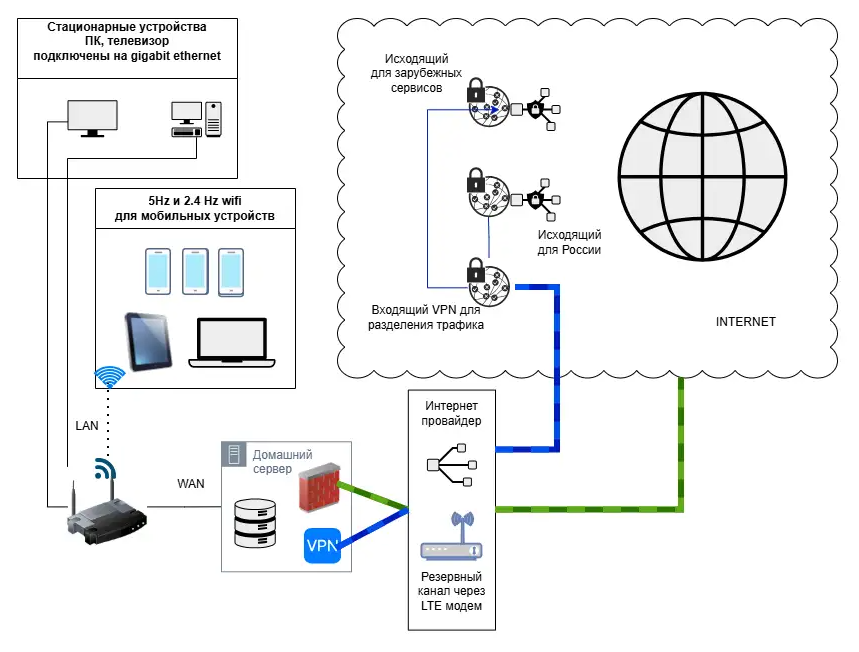
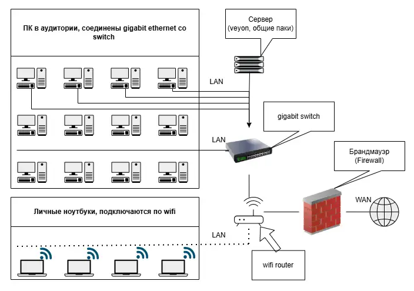

# Домашняя работа 1

## 1. Придумать какую сеть вы хотели бы построить
Я бы хотел построить такую домашнюю сеть:
Сеть состоит из гигабитного wifi роутера, к которому подключаются стационарные
(предпочтительно по кабелю) и мобильные устройства
Но WAN от роутера идет не к провайдеру, а к домашнему серверу, который выступает в
качестве моста в интернет.
На сервере находится хранилище, VPN c раздельным проксированием и брандмауэр.
Для подключения к интернету используется проводной доступ и резервный канал через
LTE.
В интернете 3 сервера для раздельного проксирования и безопасного просмотра.
Также я нарисовал схему. в drawio

https://drive.google.com/file/d/1cE9ENGx-CMStknxtenn1xcZfvppF0qKt/view?usp=sharing

## 2. Нарисовать сеть для аудитории в которой вы занимаетесь, на сайте draw.io

https://drive.google.com/file/d/1OzlQr9L-i81jDhlTWTvcyhx91gqL7s6E/view?usp=sharing

