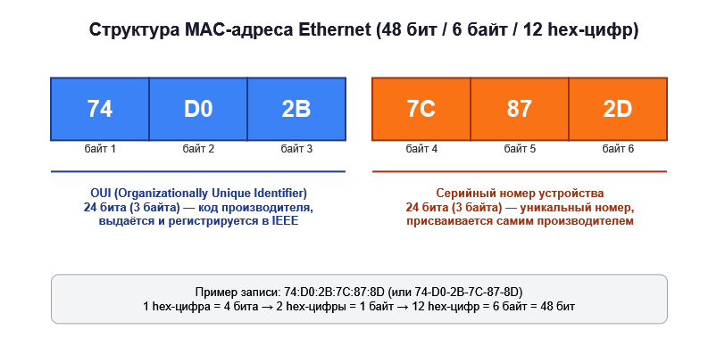
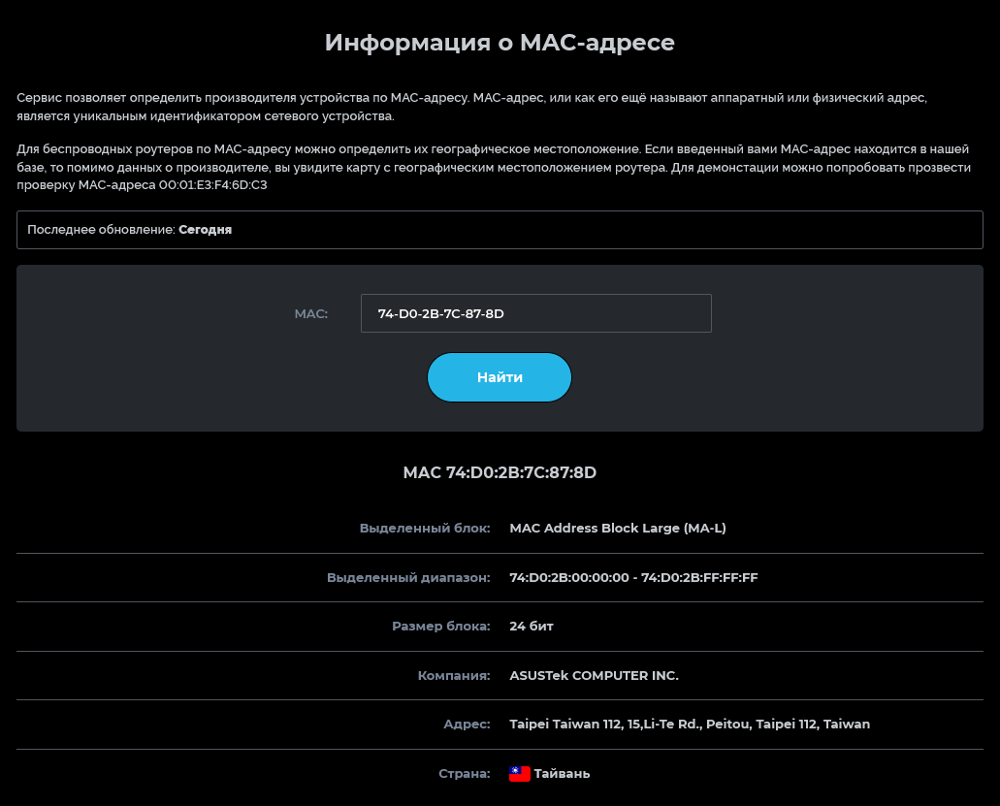
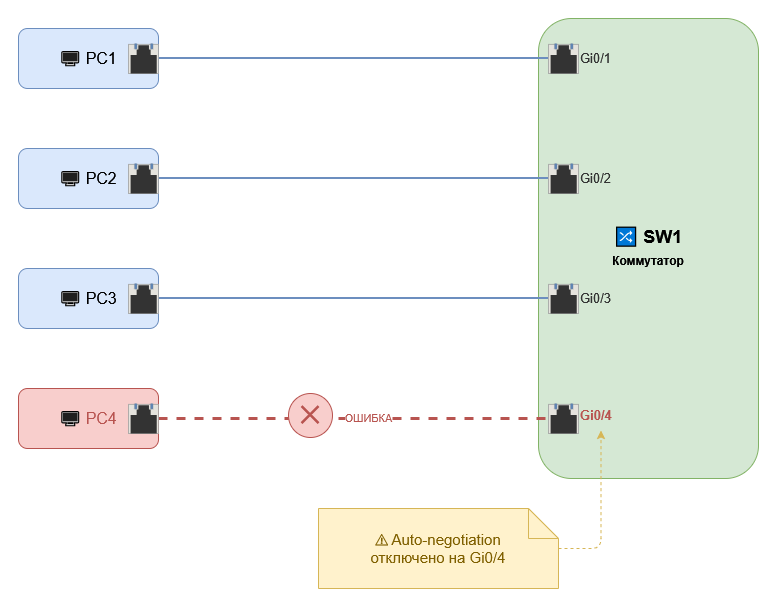

# Домашняя работа 2

# Домашнее задание

## 1. Схема MAC-адреса Ethernet

MAC-адрес (Media Access Control) — это 48-битный (6-байтовый) адрес сетевого интерфейса, который записывается в виде 12 шестнадцатеричных цифр. Для примера я взял mac адрес с сетевой карты моего домашнего ПК `74:D0:2B:7C:87:8D`. Адрес прошивается производителем в память сетевого адаптера и используется коммутаторами уровня 2 модели OSI для принятия решений о пересылке кадров.

*Рисунок 1 — Структура MAC-адреса Ethernet: OUI и уникальный номер устройства (исходник: [`mac_sch.drawio`](src/mac_sch.drawio))*

MAC-адрес состоит из двух равных по длине частей:

- **Первые 3 байта (24 бита) — OUI** (Organizationally Unique Identifier). Это идентификатор производителя оборудования, который выдаётся и регистрируется в организации IEEE.
- **Последние 3 байта (24 бита) — уникальный серийный номер** конкретного устройства/сетевой платы, который присваивается самим производителем в рамках выданного ему диапазона OUI.

Благодаря такой структуре гарантируется, что MAC-адрес любого сетевого устройства в мире остаётся уникальным: производитель отвечает за уникальность второй половины адреса в пределах своего OUI, а IEEE — за уникальность самого OUI между производителями.

Посмотреть информацию о mac адресе можно, например, на сайте https://2ip.io/ru/mac-address/

*Рисунок 2 — Информация о MAC-адресе с сайта 2ip.io*

---

## 2. Схема подключения компьютеров к коммутатору

На схеме (Рисунок 3) представлено подключение четырех компьютеров (PC1–PC4) к коммутатору SW1 по технологии Gigabit Ethernet. Компьютеры PC1, PC2 и PC3 подключены корректно к портам Gigabit Ethernet Gi0/1, Gi0/2 и Gi0/3 соответственно. Компьютер PC4 подключён к порту Gi0/4 с ошибкой поэтому link не горит.

*Рисунок 3 — Подключение компьютеров к коммутатору (исходник: [`sw_connect.drawio`](src/sw_connect.drawio))*

Принцип работы коммутатора в такой топологии основан на построении и использовании таблицы MAC-адресов (CAM-таблицы):

- **Обучение (learning).** При включении коммутатора его таблица MAC-адресов пуста. Получая кадр на каком-либо порту, коммутатор запоминает MAC-адрес источника этого кадра и номер порта, с которого он пришёл, добавляя запись в таблицу.
- **Пересылка (forwarding).** Если MAC-адрес назначения уже есть в таблице, коммутатор пересылает кадр только на соответствующий порт (фильтрация кадров). Если адреса назначения в таблице нет — кадр пересылается на все порты, кроме входящего («одноадресная рассылка неизвестному получателю»).

---

### Ситуация возникновения ошибки и способ ее устранения

* **Описание ситуации**

Компьютер PC4 подключён к порту Gi0/4 с ошибкой.
На данном порту коммутатора отключено автоматическое согласование параметров соединения (Auto Negotiation), поэтому соединение с PC4 не устанавливается корректно и физический индикатор Link не загорается. Данная ошибка демонстрирует необходимость согласования параметров Ethernet-интерфейсов для установления сетевого соединения.

* **Способ устранения**

    - Включить автоопределение (auto-negotiation) одновременно на обеих сторонах канала — и на порту коммутатора, и на сетевой карте компьютера. Это самый надёжный вариант.
    - Если по какой-либо причине автоопределение не используется, вручную задать одинаковые параметры скорости и дуплекса на обоих концах линии.
