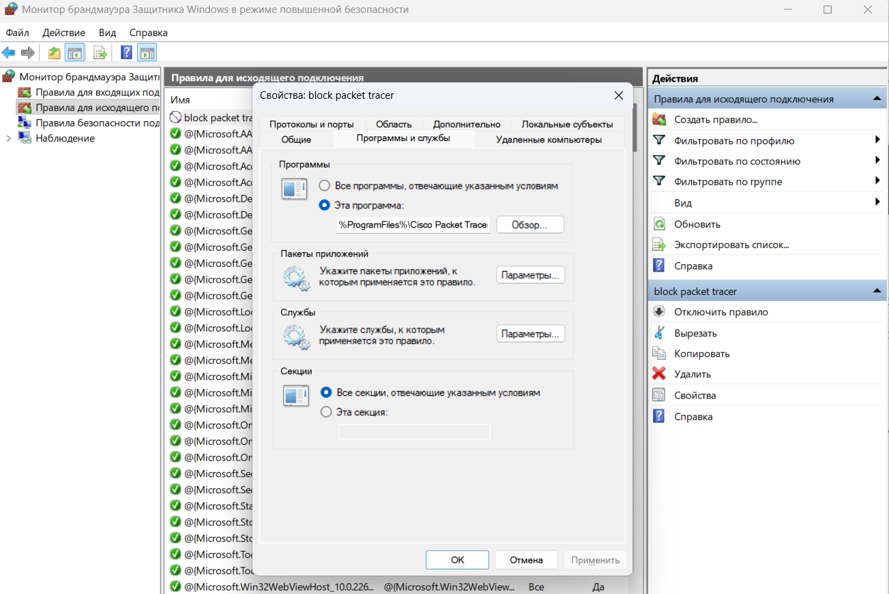
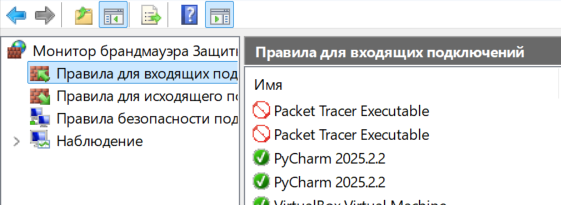
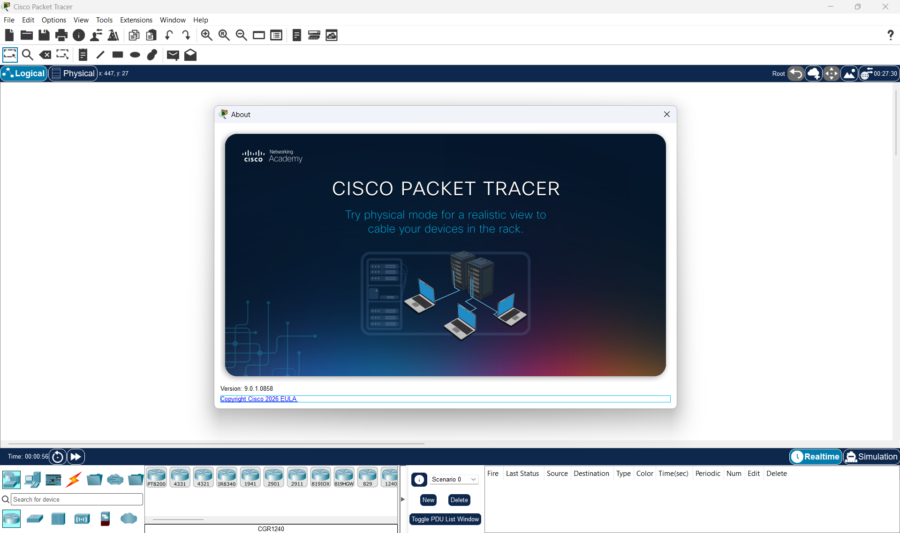

# Домашняя работа 4

Это и следующее дз пересекаются в части установки cisco packet tracer и блокировки его в firewall. Поэтому я здесь сразу добавлю необходимые скриншоты для обоих заданий 

## Установка и блокировка cisco packet tracer

### Блокировка в firewall

Весь исходящий трафик

Весь входящий трафик

### Работающий cisco packet tracer

## Задание 1

`Вам потребуется распределить 192.168 /24 IP адрес на подсети где 5 зданий с маршрутами и в каждом от 15 до 25 устройств.`

Если в каждом здании нужна своя подсеть, то нам понадобится 5 сетей => для их номерации нужно минимум 3 бита. 

Т.к. в сети может быть от 15 до 25 устройств нам понадобятся 5 бит для хостов. (VLSM использовать не получится потому что для 15 устройств все равно нужно 5 бит т.к. при 4 битах хостов будет 14 от 1 до 14 потому что 0 это адрес сети а 15 это широковещательный адрес)

Всего нам понадобятся 3 + 5 = 8 бит т.е. адреса 192.168 /24 нам как раз хватит

Например нам выделили сеть 192.168.5.0 /24

Т.е. адреса хостов будут 192.168.5.x /27 (маска подсети будет 255.255.255.224)

| Здание | Адрес сети | Широковещательный   адрес | Адреса хостов |
| -- | -- | -- | -- |
| 1 | 192.168.5.0/27 | 192.168.5.31/27 | 192.168.5.1/27 - 192.168.5.30/27
| 2 | 192.168.5.32/27 | 192.168.5.63/27 | 192.168.5.33/27 - 192.168.5.62/27
| 3 | 192.168.5.64/27 | 192.168.5.95/27 | 192.168.5.65/27 - 192.168.5.94/27
| 4 | 192.168.5.96/27 | 192.168.5.127/27 | 192.168.5.97/27 - 192.168.5.126/27
| 5 | 192.168.5.128/27 | 192.168.5.159/27 | 192.168.5.129/27 - 192.168.5.158/27

## Задание 2

`Найдите нужную длину для /* для 20 подсетей и 10 узлов`

Для 20 подсетей нужно минимум 5 бит, а для 10 узлов нужно минимум 4 бита.
Т.е. нам нужно 9 бит. 
Нам должны выделить сеть /23 (или лучше например /16; **/24 не хватит**)
Адреса хостов будут /28

