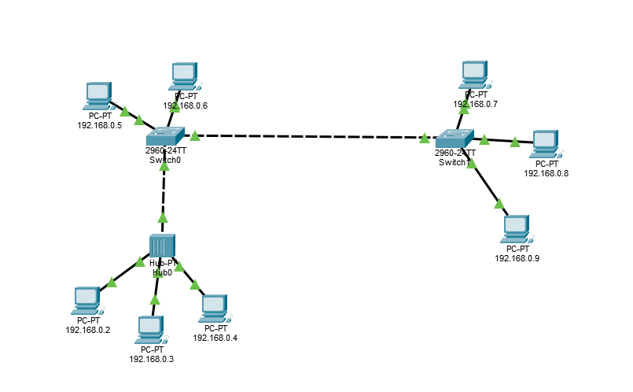
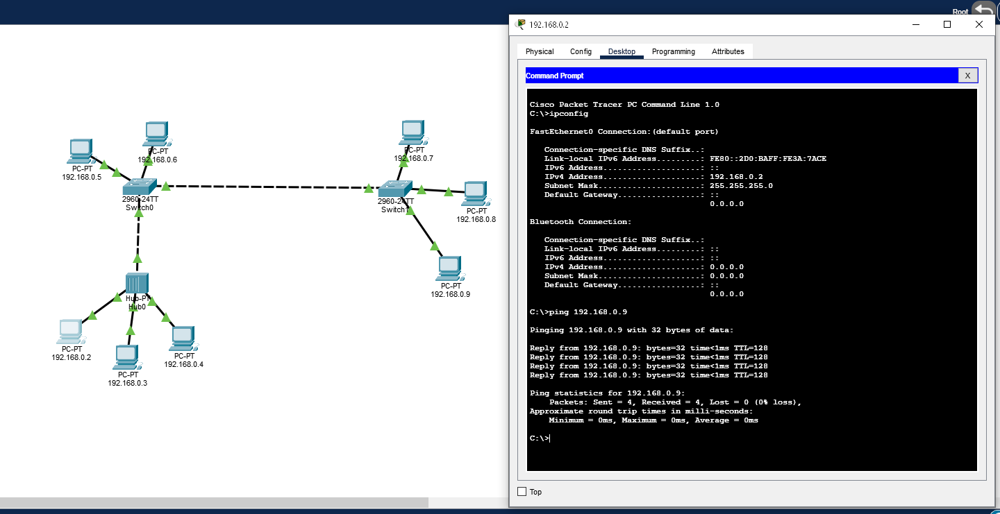
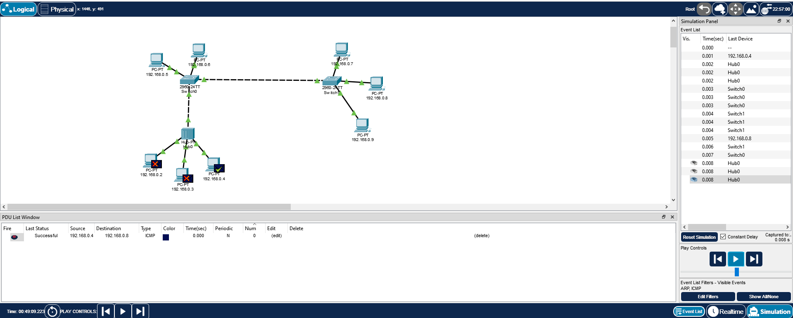
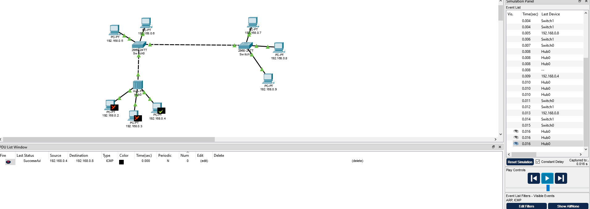

# Домашняя работа 6

`Вам потребуется построить сеть в циско с 8 компьютераи 2 комутаторами и 1 хабом`

Я сделал названия ПК соответствующим его ip адресу
ip адреса назначил от 192.168.0.2/24 до 192.168.0.9/24 
К хабу подключил 3 компьютера 
К Switch0 подключил хаб и еще 2 компьютера
Switch0 и Switch1 соединил через гигабитные порты
И к Switch1 подключил еще 3 компьютера

Проверка ping через терминал

Настройка и запуск симуляции

В симуляции у меня осталось только icmp, потому что я не сделал скриншот при первом запуске, а потом arp оказался в кэше.
Поэтому я сделал 'Power Cycle All devices' и запустил симуляцию еще раз, было уже два "конвертика" ARP и ICMP

