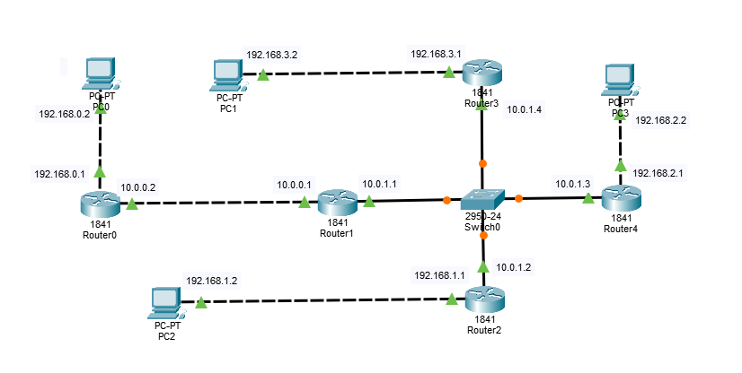
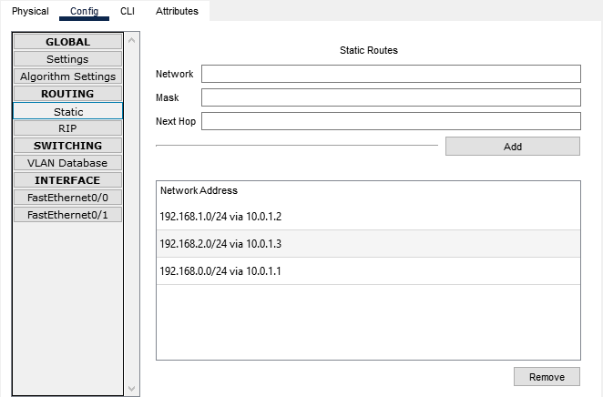
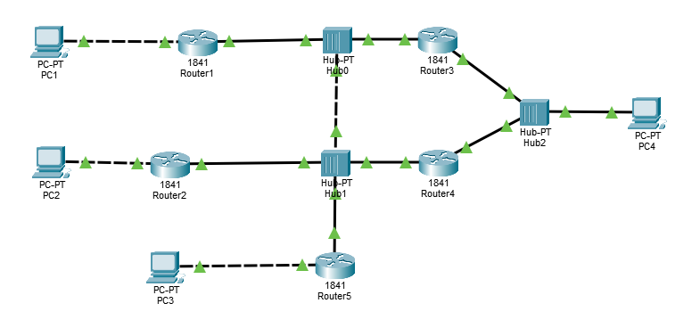
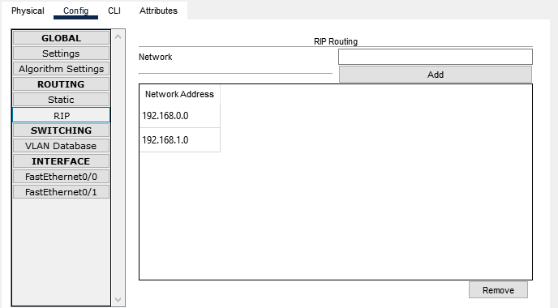
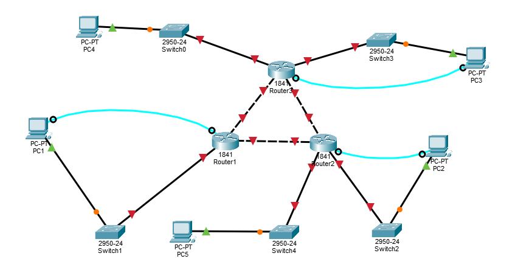

# Схемы для настройки на паре

## Схема 1 для статической маршрутизации

IP адреса написаны около каждого подключения. В каждом роутере прописано статическая маршрутизация.

Настройки маршрутизации для роутера 3

## Схема 2 для маршрутизации RIP

Адреса ПК задал как 192.168.x.2/24 где x номер ПК от 1 до 4
Адреса роутеров со стороны ПК 192.168.x.1 и 192.168.4.16 (ПК 4 подключены 2 роутера) а с другой стороны все роутеры находятся в одной сети 192.168.0.0/24. Адреса роутеров в этой сети 192.168.0.x где x номер роутера от 1 до 5

Настройка RIP для роутера 1

## Схема 3 

Схема для протокола OSPF

Пока еще не настроил