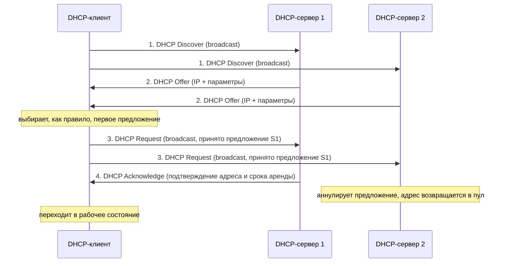
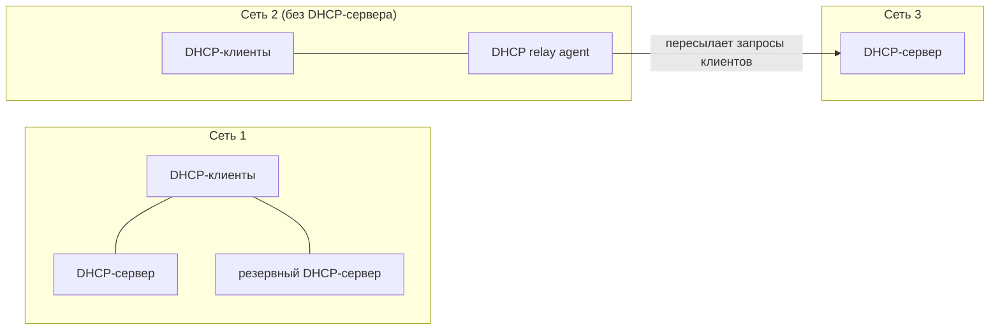
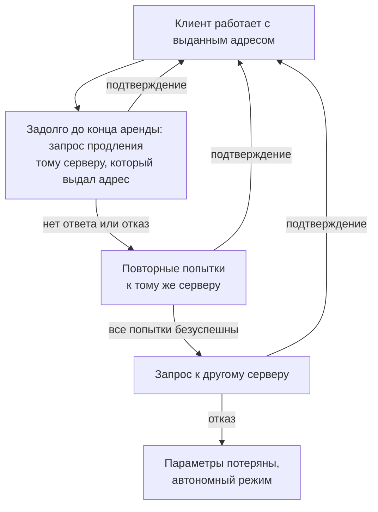

# Конспект DHCP

## Зачем нужен DHCP

Для работы в сети каждому интерфейсу компьютера и маршрутизатора нужен IP-адрес, а вручную его назначать неудобно: администратор должен помнить, какие адреса уже заняты, а какие свободны.

Кроме адреса клиенту нужны и другие параметры стека TCP/IP:

- маска подсети;
- IP-адрес маршрутизатора по умолчанию (шлюза);
- IP-адрес DNS-сервера;
- доменное имя компьютера.

Даже в небольшой сети настраивать всё это вручную утомительно. **DHCP (Dynamic Host Configuration Protocol, протокол динамического конфигурирования хостов)** автоматизирует настройку сетевых интерфейсов и гарантирует отсутствие дублирующихся адресов за счёт централизованного управления их распределением.

## История: RARP → BOOTP → DHCP

DHCP появился не сразу, у него есть два предшественника.

**RARP (Reverse Address Resolution Protocol)**: одна из первых реализаций выдачи IP-адресов, появилась более 30 лет назад. Клиент отправляет запрос на широковещательный адрес сети, сервер находит в своей базе привязку MAC-адреса клиента к IP и отвечает IP-адресом. Недостатки:

- нужно настраивать сервер в каждом сегменте локальной сети;
- нужно регистрировать MAC-адреса на сервере;
- передать клиенту дополнительную информацию нельзя.

**BOOTP (Bootstrap Protocol)**: сначала использовался для бездисковых рабочих станций, которым нужен не только IP-адрес, но и адрес TFTP-сервера и имя файла загрузки. В отличие от RARP, поддерживает **relay**: небольшие сервисы, пересылающие запросы «главному» серверу. Поэтому один сервер может обслуживать сразу несколько сетей. Недостатки: таблицы по-прежнему настраиваются вручную, а размер дополнительной информации ограничен.

**DHCP** является совместимым расширением BOOTP: DHCP-сервер поддерживает устаревших BOOTP-клиентов, но не наоборот.

## Режимы работы DHCP

DHCP работает по модели клиент-сервер. При старте системы клиент посылает в сеть широковещательный запрос на получение IP-адреса, сервер отвечает сообщением с адресом и другими параметрами. Во всех режимах администратор задаёт серверу один или несколько диапазонов IP-адресов, причём все они относятся к одной сети (имеют один и тот же номер сети).

| Режим | Как выдаётся адрес | Соответствие клиент ↔ адрес |
| --- | --- | --- |
| Ручное назначение статических адресов | Администратор сам задаёт жёсткое соответствие IP-адреса физическому адресу (или другому идентификатору) клиента | Постоянное, задано администратором: клиент всегда получает один и тот же адрес |
| Автоматическое назначение статических адресов | Сервер сам выбирает произвольный адрес из пула | Постоянное: возникает при первой выдаче, при всех следующих запросах клиент получает тот же адрес |
| Автоматическое распределение динамических адресов | Сервер выдаёт адрес из пула на ограниченное время (срок аренды, lease) | Временное: адрес освобождается и может быть выдан другому компьютеру |

При динамическом распределении ни пользователь, ни администратор не вмешиваются в процесс. Когда компьютер покидает подсеть, адрес освобождается, а при подключении к другой подсети клиент автоматически получает новый.

### Пример: 500 сотрудников и 64 адреса

Сотрудники организации большую часть времени работают вне офиса, у каждого есть ноутбук. Сколько адресов нужно?

- **Адрес каждому из 500.** Придётся получить у провайдера две сети класса C и оборудовать 500 рабочих мест, а большая часть ресурсов будет простаивать.
- **Адреса по числу людей, обычно присутствующих в офисе** (например, не более 50, значит, пул из 64 адресов и 64 разъёма). Но тогда возникает вопрос, кто будет настраивать компьютеры, состав которых постоянно меняется. Настройка вручную требует много рутинной работы, это плохое решение.
- **Динамические адреса DHCP.** Администратор один раз задаёт на сервере диапазон из 64 адресов, а приходящий сотрудник просто подключает ноутбук: DHCP-клиент сам запрашивает параметры и получает их.

Итог: динамическое распределение позволяет построить сеть, где узлов больше, чем доступных адресов. Для 500 мобильных сотрудников хватает 64 адресов и 64 рабочих мест. Основное преимущество DHCP при этом остаётся прежним: администратору не нужно вручную настраивать стек TCP/IP на каждом компьютере.

## Алгоритм динамического назначения адресов

Администратор управляет процессом через два основных параметра DHCP-сервера:

- **пул адресов**, доступных для распределения;
- **срок аренды (lease time)**: как долго клиент может пользоваться адресом, прежде чем снова запросить его у сервера. Он зависит от режима работы пользователей. В учебной сети, куда студенты приходят на лабораторные работы, он может равняться длительности лабораторной. В корпоративной сети, где сотрудники работают постоянно, это несколько дней или даже недель.

### Четыре сообщения: DORA

Получение адреса состоит из четырёх сообщений, первые буквы которых дают аббревиатуру **DORA**: **D**iscover, **O**ffer, **R**equest, **A**cknowledge.

1. **DHCP Discover** (DHCP-поиск). При включении компьютера DHCP-клиент посылает ограниченное широковещательное сообщение: IP-пакет с адресом назначения из одних единиц, который должен быть доставлен всем узлам данной IP-сети.
2. **DHCP Offer** (DHCP-предложение). Все DHCP-серверы, получившие Discover, отправляют клиенту свои предложения. Каждое содержит IP-адрес и другую конфигурационную информацию. Сервер из другой сети отвечает через DHCP relay agent.
3. **DHCP Request** (DHCP-запрос). Клиент собирает предложения, как правило выбирает первое пришедшее и рассылает широковещательный запрос. В нём указаны идентификатор сервера, чьё предложение принято, и значения принятых параметров.
4. **DHCP Acknowledge** (DHCP-квитанция, положительное подтверждение). Запрос получают все серверы, но подтверждение с адресом и параметрами аренды отправляет только выбранный. Остальные серверы аннулируют свои предложения и возвращают предложенные адреса в пулы. Получив подтверждение, клиент переходит в рабочее состояние.

### Где должен стоять сервер: DHCP relay agent

Клиенты отправляют широковещательные запросы, поэтому DHCP-сервер должен находиться в одной подсети с ними. Для отказоустойчивости иногда ставят резервный DHCP-сервер (сеть 1 на схеме).

Бывает и наоборот: в сети нет ни одного DHCP-сервера. Тогда его подменяет **DHCP relay agent** (связной DHCP-агент), то есть программа-посредник между клиентами и серверами. Он пересылает Discover из своей сети серверу, адрес которого ему заранее известен, а ответы сервера возвращает клиентам. Так один DHCP-сервер обслуживает клиентов нескольких разных сетей.

## Продление и прекращение аренды

Время от времени клиент пытается обновить параметры аренды. Первую попытку он делает задолго до окончания срока аренды, обращаясь к тому серверу, от которого получил текущие параметры. Если ответа нет или он отрицательный, запрос повторяется через некоторое время. Если несколько попыток к тому же серверу безуспешны, клиент обращается к другому серверу. Если и тот отказывает, клиент теряет конфигурационные параметры и переходит в режим автономной работы. Клиент также может по своей инициативе досрочно отказаться от выделенных параметров.

## Проблемы динамических адресов

При динамическом назначении нельзя быть уверенным, какой адрес сейчас у того или иного узла. Это порождает проблемы:

| Проблема | В чём она состоит | Как решают |
| --- | --- | --- |
| DNS | Трудно поддерживать соответствие символьных имён и IP-адресов, если адреса меняются, например, каждые два часа | Серверам, к которым часто обращаются по имени, дают статические адреса. Если серверов очень много, используют динамический DNS, который согласует адресные базы DHCP и DNS |
| Удалённое управление и мониторинг | Сложно управлять интерфейсом и собирать статистику, если его идентификатор (IP-адрес) постоянно меняется | Статические адреса: устройство проще найти, когда его адрес известен |
| Безопасность | Многие устройства фильтруют пакеты по значениям полей, и при динамических адресах фильтрация по IP усложняется | Не использовать динамическое назначение для интерфейсов, которые участвуют в системах мониторинга и безопасности |

Статические адреса обычно получают устройства, предоставляющие услуги в сети и вряд ли меняющие своё физическое и логическое расположение: маршрутизаторы, серверы, принтеры. Динамические адреса оставляют для клиентских компьютеров.

## Описание в RFC

Все рассмотренные протоколы стандартизированы и описаны в документах **RFC (Request for Comments)**, которые публикует IETF:

| Протокол | RFC |
| --- | --- |
| RARP | [RFC 903](https://www.rfc-editor.org/rfc/rfc903) |
| BOOTP | [RFC 951](https://www.rfc-editor.org/rfc/rfc951), уточнения о relay: [RFC 1542](https://www.rfc-editor.org/rfc/rfc1542) |
| DHCP | [RFC 2131](https://www.rfc-editor.org/rfc/rfc2131), параметры (options): [RFC 2132](https://www.rfc-editor.org/rfc/rfc2132) |

## Кратко

- DHCP автоматически выдаёт клиенту IP-адрес и остальные параметры стека TCP/IP и исключает дублирование адресов.
- Он развился из RARP и BOOTP и совместим с BOOTP.
- Три режима: ручное назначение статических адресов, автоматическое назначение статических адресов, динамическое распределение с ограниченным сроком аренды.
- Адрес выдаётся обменом сообщений DORA: Discover, Offer, Request, Acknowledge.
- Клиенты используют broadcast, поэтому сервер должен быть в той же подсети, либо запросы пересылает DHCP relay agent.
- Аренду клиент продлевает заранее, сначала у своего сервера, затем у другого.
- Серверам, маршрутизаторам и принтерам лучше давать статические адреса, динамические оставлять для клиентских компьютеров.
